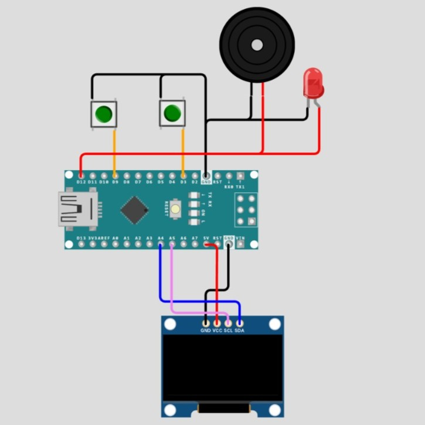

# KADO SELAMAT ULANG TAHUN
Proyek ini merupakan sistem ucapan ulang tahun interaktif menggunakan Arduino Nano, OLED Display 0.96 inch, dual-button password input, dan buzzer yang memainkan lagu. Pengguna harus memasukkan password terlebih dahulu sebelum animasi ucapan, pemutaran lagu, dan slideshow ditampilkan.

## CARA MENGGUNAKAN
	1. ubah password pada baris kode 12
	2. ubah nama dan kata ucapan pada baris 307 - 346

## FOTO RANGKAIAN

